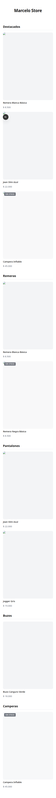
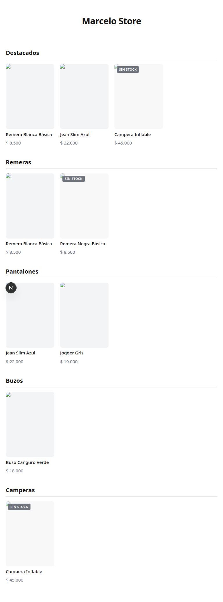
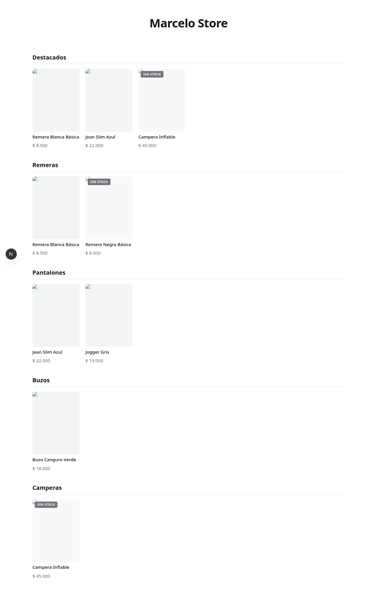

## Título
Catálogo de productos desde Google Sheets (CSV publicado)

## Contexto
Antes de tocar código, usá mem_context (proyecto marcelo-store)
para la spec completa acordada con el cliente. El catálogo se
alimenta de una hoja de Google Sheets publicada como CSV — sin
API de Google, sin credenciales, solo fetch de una URL pública.

Esquema de columnas (fijo, no inventar otras):
id, nombre, categoria, precio, imagen_url, disponible (Sí/No),
destacado (Sí/No)

## Alcance

- Variable de entorno CATALOG_SHEET_URL con el link CSV publicado
  (el gerente la va a proveer en .env.local, no la hardcodees)
- Función que hace fetch del CSV, lo parsea (librería papaparse),
  y lo tipa contra el esquema de arriba
- Server Component de Next.js que muestra el catálogo agrupado por
  categoría, con badge "Sin stock" en los productos con disponible=No
  (mostrarlos igual, no ocultarlos — el cliente puede querer que se
  vean aunque no se puedan comprar)
- Sección de "Destacados" en portada con los productos destacado=Sí
- Usar ISR (revalidate cada 60 segundos) — no estático puro (Marcelo
  necesita ver reflejados sus cambios de precio/stock sin esperar
  un nuevo deploy) ni SSR en cada request (innecesario para este
  volumen)
- Manejo de error: si el fetch del CSV falla, mostrar el último
  catálogo cacheado si existe, o un mensaje claro de "catálogo
  temporalmente no disponible" — NUNCA una pantalla en blanco o un
  error crudo
- Fixture local de CSV de prueba en tests/ (datos inventados por
  vos mismo, NO depender de la hoja real ni de red en los tests —
  mismo principio que ya aplicamos en traza/posta/ancla). Como
  todavía no tenemos el link real de Google Sheets, el desarrollo y
  la verificación de este ticket se hacen ENTERAMENTE contra este
  fixture local — no bloquees nada esperando la URL real
- Script de Playwright (tests/e2e/screenshots.spec.ts) que captura el
  catálogo en 3 viewports (375px, 768px, 1280px) y guarda los PNG como
  evidencia en las notas de cierre. Solo screenshots, nada más elaborado
  (no asserts visuales ni comparación de baseline)

## Explícitamente afuera de este ticket
- Talles/stock por variante — queda para si se necesita después
- Botón de WhatsApp — ticket aparte
- Carrusel de promociones — ticket aparte
- Conectar la URL real de Google Sheets — se hace después, por el
  gerente, cambiando una variable de entorno, sin tocar código

## Criterios de aceptación
- [x] Catálogo se renderiza agrupado por categoría desde el CSV real
      de prueba (fixture local)
- [x] disponible=No muestra badge "Sin stock", no oculta el producto
- [x] destacado=Sí aparece en sección de portada
- [x] Fetch fallido no rompe la página — fallback claro
- [x] Tests con fixture local, sin red real
- [x] USER_MANUAL.md actualizado con instrucciones reales de cómo
      Marcelo edita la planilla (ya no es "⏳ Pendiente")
- [x] Script de Playwright captura el catálogo en 375/768/1280px y los
      PNG quedan adjuntos como evidencia en las notas de cierre

## Notas de cierre
Implementado el 2026-07-13. Esta es la versión con la columna `id` agregada al
esquema (re-emisión del ticket sobre el trabajo previo que no la tenía).

Capa de datos — `lib/catalog.ts`:
- `Product` ahora incluye `id: string` como primer campo. `rowToProduct` toma
  `id` del CSV; si faltara, cae al `nombre` (para no quedarnos sin key de React).
  Sigue descartando filas sin nombre.
- Resto igual a la implementación previa: `parseCatalog` (papaparse), `fetchCatalogCsv`
  (fetch de CATALOG_SHEET_URL con `next:{revalidate:60}`), `createCatalogLoader`
  (factory con último-catálogo-bueno → status ok/stale/error), helpers
  `groupByCategoria` / `getDestacados`.

UI — `app/page.tsx` (Server Component, `revalidate = 60` → ISR):
- Destacados (destacado=Sí) + catálogo agrupado por categoría; badge "Sin stock"
  en disponible=No (no se oculta); status `error` → aviso claro.
- `ProductGrid` ahora usa `key={p.id}` (antes categoría+nombre).

Tests — Vitest, `tests/catalog.test.ts` (13, +1 respecto a la versión previa) +
`tests/fixtures/catalog.csv` (ahora con columna `id`: REM-001, REM-002, PAN-001,
PAN-002, BUZ-001, CAM-001). El test nuevo cubre que se conserva el id del CSV y
que cae al nombre si falta la columna. Todo con fixture local, sin red — el
ticket se desarrolló y verificó ENTERAMENTE contra el fixture (sin URL real).

Docs — USER_MANUAL.md: columna `id` en la tabla + "código único e irrepetible",
instrucción de asignar un id nuevo al agregar una prenda, y regla de unicidad.
README.md: esquema actualizado con `id`.

Screenshots de evidencia — Playwright (`tests/e2e/screenshots.spec.ts`,
`playwright.config.ts`, `tests/e2e/csv-server.mjs`). Solo captura, sin asserts
visuales. `playwright.config.ts` levanta dos webServers locales: el csv-server
que sirve el fixture y `next dev` apuntado a él vía CATALOG_SHEET_URL — sin red
real. Se corre con `npm run test:e2e`. NO se agregó a CI (evita descargar
Chromium en cada corrida; es una herramienta de evidencia, no un gate).

Evidencia local:
- `npm run lint` → ✔ 0 warnings
- `npm test` → 13 passed
- `npm run build` → ✓ compila; ruta `/` con `Revalidate 1m` (ISR)
- Smoke E2E contra server local del fixture: Destacados, 4 categorías, badge
  "Sin stock" en agotados (visibles), 9 cards (3 destacados + 6 categorías).
- `npm run test:e2e` → 3 passed. Screenshots del catálogo (fullPage) en los 3
  viewports pedidos:
  - 375px (mobile):  
  - 768px (tablet):  
  - 1280px (desktop): 
  Nota: las imágenes de producto salen "rotas" en las capturas porque el
  fixture usa URLs ficticias (example.com). El catálogo real usará las fotos
  que cargue Marcelo en la planilla. Lo que la evidencia demuestra es el layout
  responsive, el agrupado por categoría, la sección Destacados y el badge
  "Sin stock".

Fuera de alcance (no tocado): talles/variantes, WhatsApp, carrusel, y conectar
la URL real de Google Sheets (lo hace el gerente cambiando CATALOG_SHEET_URL,
sin tocar código).

Pendiente del gerente: proveer CATALOG_SHEET_URL real (dev/Vercel) cuando esté
la hoja; commit/push. Lighthouse cuando haya datos reales.
